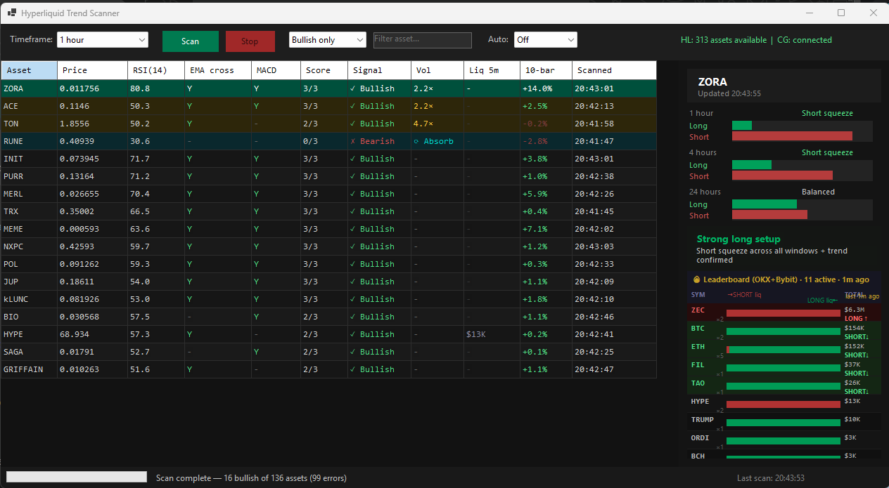

# Hyperliquid Trading Scanner helper



A Windows Forms app that scans all Hyperliquid perpetual assets and identifies
which are trending bullish across selectable timeframes.

## Requirements

- Windows 10/11
- [.NET 8 SDK](https://dotnet.microsoft.com/download/dotnet/8.0)
- Visual Studio 2026 (or `dotnet build` from the command line)

## Setup

1. Clone or download this repository
2. Copy `config.json.template` to `config.json` (or let the app create one on first run)
3. Fill in your wallet address:

```json
{
  "walletAddress": "0xYOUR_WALLET_ADDRESS",
  "privateKey": "",
  "defaultTimeframe": "1h",
  "maxAssets": 200,
  "bullishThreshold": 2,
  "requestDelayMs": 100
}
```

4. Build and run:
```
dotnet build
dotnet run
```

## Config options

| Field | Description |
|---|---|
| `walletAddress` | Your MetaMask/Hyperliquid wallet address (required) |
| `privateKey` | Private key for private endpoints — leave empty for market-only scanning |
| `defaultTimeframe` | Default selected timeframe on startup (`15m`, `1h`, `4h`, `1d`, `3d`) |
| `maxAssets` | Cap on assets to scan (Hyperliquid has ~150 perps) |
| `bullishThreshold` | How many of 3 indicators must agree: `1`=loose, `2`=balanced, `3`=strict |
| `requestDelayMs` | Delay between API requests in ms — increase if you hit rate limits |

## Security

- **Never commit config.json** — it's in `.gitignore` for this reason
- For private key, use a Hyperliquid API sub-wallet (not your main MetaMask key)
- Consider encrypting the private key at rest using Windows DPAPI

## Trend indicators

Each asset is scored against three signals on the selected timeframe:

1. **EMA crossover** — 9-period EMA above 21-period EMA
2. **RSI momentum** — RSI(14) above 50
3. **MACD signal** — MACD line above signal line

An asset is flagged bullish when it hits `bullishThreshold` out of 3.

## NuGet packages

- `Newtonsoft.Json` — JSON serialisation
- `Skender.Stock.Indicators` — EMA, RSI, MACD calculations
- `Nethereum.Signer` — ETH signing for private endpoints (future use)
